# @freewriter/core — Architecture

> Pure TypeScript canvas-based word processor engine — zero runtime dependencies.
> **Status:** Phase 2 (Core Editor Loop) — interactive editing, caret, selection, input handling.

---

## 1. High-Level Module Overview

The core package is split into **six modules** with a strict dependency hierarchy. Phase 2 introduced three new modules (**state**, **layout**, **input**) and an **editor** orchestrator on top of the Phase 1 foundation (**model**, **measurement**, **renderer**).

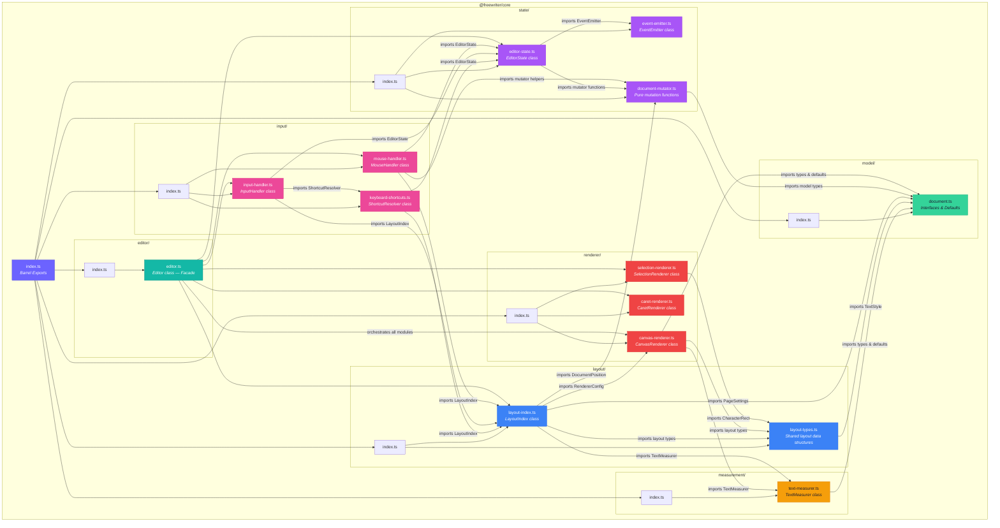
```mermaid
graph TD
    subgraph "@freewriter/core"
        INDEX["index.ts<br/><i>Barrel Exports</i>"]

        subgraph "model/"
            M_DOC["document.ts<br/><i>Interfaces & Defaults</i>"]
            M_IDX["index.ts"]
        end

        subgraph "measurement/"
            MS_TM["text-measurer.ts<br/><i>TextMeasurer class</i>"]
            MS_IDX["index.ts"]
        end

        subgraph "layout/"
            L_TYPES["layout-types.ts<br/><i>Shared layout data structures</i>"]
            L_INDEX["layout-index.ts<br/><i>LayoutIndex class</i>"]
            L_IDX["index.ts"]
        end

        subgraph "state/"
            S_EMIT["event-emitter.ts<br/><i>EventEmitter class</i>"]
            S_MUT["document-mutator.ts<br/><i>Pure mutation functions</i>"]
            S_STATE["editor-state.ts<br/><i>EditorState class</i>"]
            S_IDX["index.ts"]
        end

        subgraph "input/"
            I_KB["keyboard-shortcuts.ts<br/><i>ShortcutResolver class</i>"]
            I_INPUT["input-handler.ts<br/><i>InputHandler class</i>"]
            I_MOUSE["mouse-handler.ts<br/><i>MouseHandler class</i>"]
            I_IDX["index.ts"]
        end

        subgraph "renderer/"
            R_CR["canvas-renderer.ts<br/><i>CanvasRenderer class</i>"]
            R_CARET["caret-renderer.ts<br/><i>CaretRenderer class</i>"]
            R_SEL["selection-renderer.ts<br/><i>SelectionRenderer class</i>"]
            R_IDX["index.ts"]
        end

        subgraph "editor/"
            E_EDITOR["editor.ts<br/><i>Editor class — Facade</i>"]
            E_IDX["index.ts"]
        end
    end

    INDEX --> M_IDX
    INDEX --> MS_IDX
    INDEX --> L_IDX
    INDEX --> S_IDX
    INDEX --> I_IDX
    INDEX --> R_IDX
    INDEX --> E_IDX

    M_IDX --> M_DOC
    MS_IDX --> MS_TM
    L_IDX --> L_TYPES
    L_IDX --> L_INDEX
    S_IDX --> S_EMIT
    S_IDX --> S_MUT
    S_IDX --> S_STATE
    I_IDX --> I_KB
    I_IDX --> I_INPUT
    I_IDX --> I_MOUSE
    R_IDX --> R_CR
    R_IDX --> R_CARET
    R_IDX --> R_SEL
    E_IDX --> E_EDITOR

    MS_TM -->|"imports types & defaults"| M_DOC
    L_TYPES -->|"imports TextStyle"| M_DOC
    L_INDEX -->|"imports PageSettings"| M_DOC
    L_INDEX -->|"imports RendererConfig"| R_CR
    L_INDEX -->|"imports TextMeasurer"| MS_TM
    L_INDEX -->|"imports layout types"| L_TYPES
    L_INDEX -->|"imports DocumentPosition"| S_MUT
    S_MUT -->|"imports model types"| M_DOC
    S_STATE -->|"imports EventEmitter"| S_EMIT
    S_STATE -->|"imports mutator functions"| S_MUT
    R_CR -->|"imports types & defaults"| M_DOC
    R_CR -->|"imports TextMeasurer"| MS_TM
    R_CR -->|"imports layout types"| L_TYPES
    R_SEL -->|"imports CharacterRect"| L_TYPES
    I_KB -->|"imports EditorState"| S_STATE
    I_KB -->|"imports LayoutIndex"| L_INDEX
    I_INPUT -->|"imports EditorState"| S_STATE
    I_INPUT -->|"imports LayoutIndex"| L_INDEX
    I_INPUT -->|"imports ShortcutResolver"| I_KB
    I_MOUSE -->|"imports EditorState"| S_STATE
    I_MOUSE -->|"imports LayoutIndex"| L_INDEX
    I_MOUSE -->|"imports mutator helpers"| S_MUT
    E_EDITOR -->|"orchestrates all modules"| R_CR
    E_EDITOR --> R_CARET
    E_EDITOR --> R_SEL
    E_EDITOR --> S_STATE
    E_EDITOR --> L_INDEX
    E_EDITOR --> I_INPUT
    E_EDITOR --> I_MOUSE

    style INDEX fill:#6c63ff,color:#fff,stroke:#5a52d5
    style M_DOC fill:#34d399,color:#1a1a2e,stroke:#2ab383
    style MS_TM fill:#f59e0b,color:#1a1a2e,stroke:#d97706
    style R_CR fill:#ef4444,color:#fff,stroke:#dc2626
    style R_CARET fill:#ef4444,color:#fff,stroke:#dc2626
    style R_SEL fill:#ef4444,color:#fff,stroke:#dc2626
    style L_TYPES fill:#3b82f6,color:#fff,stroke:#2563eb
    style L_INDEX fill:#3b82f6,color:#fff,stroke:#2563eb
    style S_EMIT fill:#a855f7,color:#fff,stroke:#9333ea
    style S_MUT fill:#a855f7,color:#fff,stroke:#9333ea
    style S_STATE fill:#a855f7,color:#fff,stroke:#9333ea
    style I_KB fill:#ec4899,color:#fff,stroke:#db2777
    style I_INPUT fill:#ec4899,color:#fff,stroke:#db2777
    style I_MOUSE fill:#ec4899,color:#fff,stroke:#db2777
    style E_EDITOR fill:#14b8a6,color:#fff,stroke:#0d9488
```

### Dependency Direction

```
model/       ← (no deps, pure data)
  ↑
measurement/ ← depends on model
  ↑
layout/      ← depends on model, measurement, renderer (for RendererConfig type)
state/       ← depends on model (mutator), no renderer dep
  ↑
renderer/    ← depends on model, measurement, layout (types only)
input/       ← depends on state, layout
  ↑
editor/      ← depends on ALL modules (Facade)
```

> [!IMPORTANT]
> The dependency flow remains **unidirectional** at the foundation. `model/` has zero imports. `state/` depends only on `model/` (via the mutator). The `editor/` module is the only one that knows about everything — it's the Facade that wires the system together.

---

## 2. Document Data Model

The model layer ([document.ts](file:///home/madhusha-laksitha/Desktop/freewriter/packages/core/src/model/document.ts)) defines a hierarchical document tree. **Unchanged from Phase 1** — the raw model interfaces were preserved; all interaction state lives in `EditorState`.

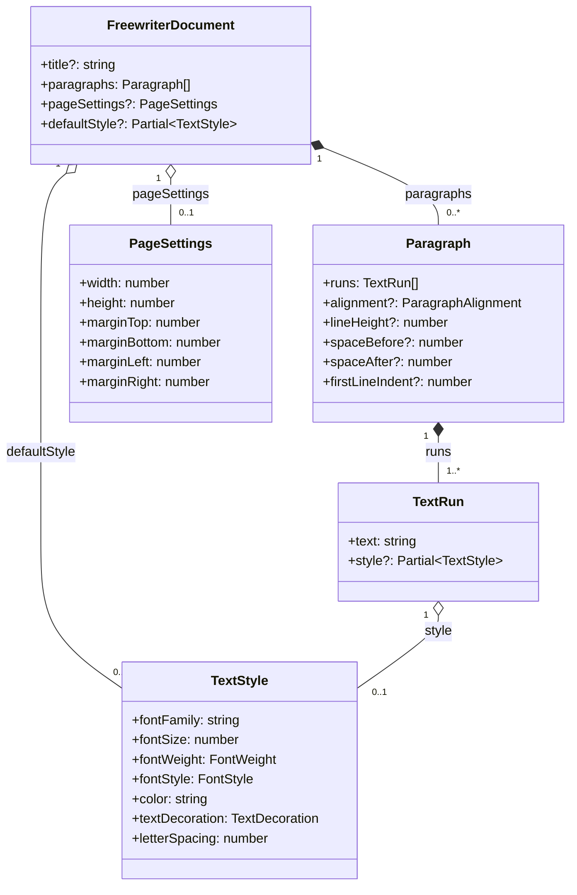
```mermaid
classDiagram
    class FreewriterDocument {
        +title?: string
        +paragraphs: Paragraph[]
        +pageSettings?: PageSettings
        +defaultStyle?: Partial~TextStyle~
    }

    class Paragraph {
        +runs: TextRun[]
        +alignment?: ParagraphAlignment
        +lineHeight?: number
        +spaceBefore?: number
        +spaceAfter?: number
        +firstLineIndent?: number
    }

    class TextRun {
        +text: string
        +style?: Partial~TextStyle~
    }

    class TextStyle {
        +fontFamily: string
        +fontSize: number
        +fontWeight: FontWeight
        +fontStyle: FontStyle
        +color: string
        +textDecoration: TextDecoration
        +letterSpacing: number
    }

    class PageSettings {
        +width: number
        +height: number
        +marginTop: number
        +marginBottom: number
        +marginLeft: number
        +marginRight: number
    }

    FreewriterDocument "1" *-- "0..*" Paragraph : paragraphs
    FreewriterDocument "1" o-- "0..1" PageSettings : pageSettings
    FreewriterDocument "1" o-- "0..1" TextStyle : defaultStyle
    Paragraph "1" *-- "1..*" TextRun : runs
    TextRun "1" o-- "0..1" TextStyle : style
```

### Type Aliases

| Type | Values | Used By |
|------|--------|---------|
| `FontWeight` | `"normal"` \| `"bold"` | `TextStyle.fontWeight` |
| `FontStyle` | `"normal"` \| `"italic"` | `TextStyle.fontStyle` |
| `TextDecoration` | `"none"` \| `"underline"` \| `"line-through"` | `TextStyle.textDecoration` |
| `ParagraphAlignment` | `"left"` \| `"center"` \| `"right"` \| `"justify"` | `Paragraph.alignment` |

### Default Constants

| Constant | Key Defaults |
|----------|-------------|
| `DEFAULT_TEXT_STYLE` | Inter, 12pt, normal weight, `#1a1a2e` color |
| `DEFAULT_PARAGRAPH_PROPS` | left-aligned, 1.5× line height, 8pt space after |
| `DEFAULT_PAGE_SETTINGS` | US Letter (612×792 pt), 1-inch (72pt) margins |

---

## 3. Measurement Engine

The measurement layer ([text-measurer.ts](file:///home/madhusha-laksitha/Desktop/freewriter/packages/core/src/measurement/text-measurer.ts)) wraps the Canvas 2D `measureText()` API with caching and style resolution. **Unchanged from Phase 1.**

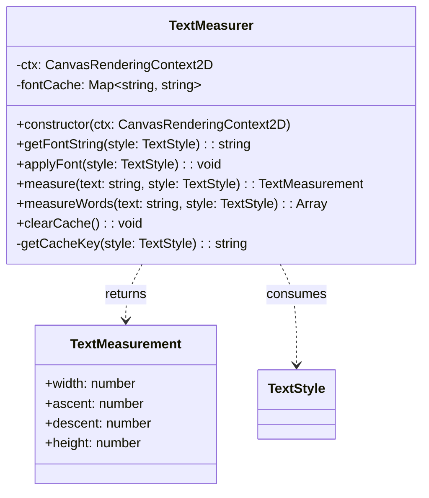
```mermaid
classDiagram
    class TextMeasurer {
        -ctx: CanvasRenderingContext2D
        -fontCache: Map~string, string~
        +constructor(ctx: CanvasRenderingContext2D)
        +getFontString(style: TextStyle): string
        +applyFont(style: TextStyle): void
        +measure(text: string, style: TextStyle): TextMeasurement
        +measureWords(text: string, style: TextStyle): Array
        +clearCache(): void
        -getCacheKey(style: TextStyle): string
    }

    class TextMeasurement {
        +width: number
        +ascent: number
        +descent: number
        +height: number
    }

    TextMeasurer ..> TextMeasurement : returns
    TextMeasurer ..> TextStyle : consumes
```

### Standalone Functions

| Function | Purpose |
|----------|---------|
| `resolveStyle(partial?)` | Merges a `Partial<TextStyle>` over `DEFAULT_TEXT_STYLE` |
| `buildFontString(style)` | Builds a CSS font shorthand — e.g. `"italic bold 16px Inter"` |

### Font Cache Strategy

The `TextMeasurer` maintains an in-memory `Map<string, string>` keyed by `fontFamily|fontSize|fontWeight|fontStyle`. This avoids rebuilding the CSS font string for repeated style combinations during layout and rendering passes.

---

## 4. State Management (Phase 2)

The state module manages all editor interaction state — cursor position, selection range, and document mutations — separate from the rendering layer.

### 4.1 Event Emitter

The [EventEmitter](file:///home/madhusha-laksitha/Desktop/freewriter/packages/core/src/state/event-emitter.ts) implements the **Observer pattern** — a lightweight, fully-typed event bus with zero external dependencies. It decouples state mutations from rendering and UI updates.

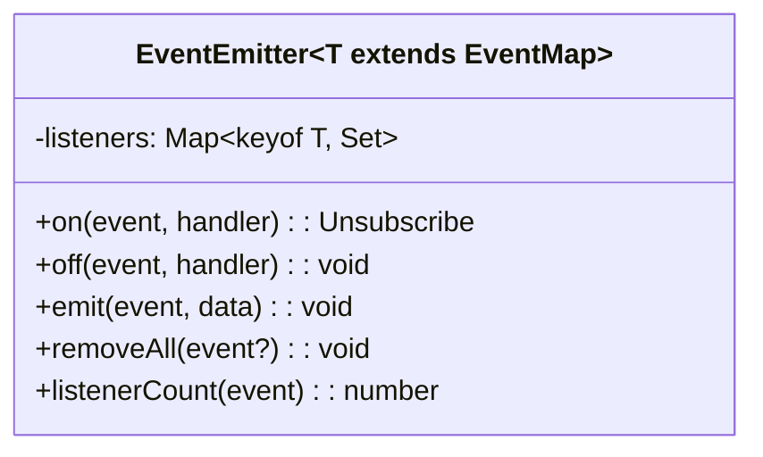
```mermaid
classDiagram
    class EventEmitter~T extends EventMap~ {
        -listeners: Map~keyof T, Set~
        +on(event, handler): Unsubscribe
        +off(event, handler): void
        +emit(event, data): void
        +removeAll(event?): void
        +listenerCount(event): number
    }
```

- Handlers are stored in `Set<>` for O(1) add/remove and duplicate prevention.
- `on()` returns an `Unsubscribe` function for idempotent cleanup.
- `emit()` iterates a snapshot of handlers, allowing safe unsubscription during emission.

### 4.2 Document Mutator

The [document-mutator.ts](file:///home/madhusha-laksitha/Desktop/freewriter/packages/core/src/state/document-mutator.ts) provides pure functions for immutable document mutations. Each function takes a document and a position, and returns a **new** document plus the resulting cursor position. This separation follows the **Single Responsibility Principle**.

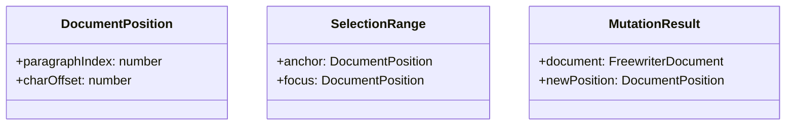
```mermaid
classDiagram
    class DocumentPosition {
        +paragraphIndex: number
        +charOffset: number
    }

    class SelectionRange {
        +anchor: DocumentPosition
        +focus: DocumentPosition
    }

    class MutationResult {
        +document: FreewriterDocument
        +newPosition: DocumentPosition
    }
```

| Function | Purpose |
|----------|---------|
| `insertTextAt(doc, position, text)` | Inserts text at the given position, inheriting the style at the cursor |
| `deleteCharBackward(doc, position)` | Backspace — deletes one character backward, or merges paragraphs |
| `deleteCharForward(doc, position)` | Delete key — deletes one character forward, or merges paragraphs |
| `deleteRange(doc, range)` | Deletes all content within a selection range (single or multi-paragraph) |
| `splitParagraphAt(doc, position)` | Enter key — splits a paragraph into two at the cursor position |
| `getTextInRange(doc, range)` | Extracts plain text content of a selection range |
| `normalizeRange(range)` | Ensures `start` is always before `end` regardless of selection direction |
| `getParagraphText(paragraph)` | Flattens all runs into a single string |
| `getParagraphTextLength(paragraph)` | Returns the total character count of a paragraph |
| `getStyleAtOffset(paragraph, offset)` | Resolves the effective style at a given character offset |

**Internal helpers** (not exported): `consolidateRuns()` removes empty runs and merges adjacent runs with identical styles after mutations. `splitRunsAtOffset()` splits a paragraph's run array at a character boundary.

### 4.3 Editor State

The [EditorState](file:///home/madhusha-laksitha/Desktop/freewriter/packages/core/src/state/editor-state.ts) is the central state container. It wraps a `FreewriterDocument` with cursor position and selection range, implements the **Mediator pattern** (mediates between input handlers, the document model, and the renderer), and emits typed events via the **Observer pattern**.

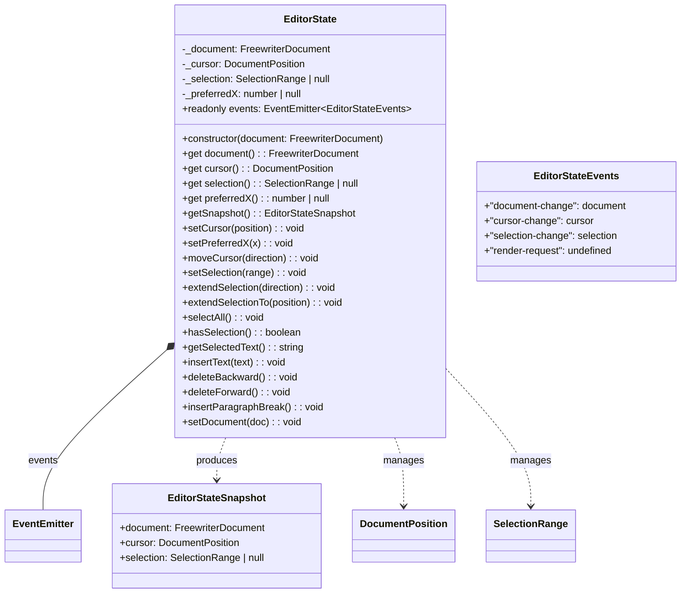
```mermaid
classDiagram
    class EditorState {
        -_document: FreewriterDocument
        -_cursor: DocumentPosition
        -_selection: SelectionRange | null
        -_preferredX: number | null
        +readonly events: EventEmitter~EditorStateEvents~
        +constructor(document: FreewriterDocument)
        +get document(): FreewriterDocument
        +get cursor(): DocumentPosition
        +get selection(): SelectionRange | null
        +get preferredX(): number | null
        +getSnapshot(): EditorStateSnapshot
        +setCursor(position): void
        +setPreferredX(x): void
        +moveCursor(direction): void
        +setSelection(range): void
        +extendSelection(direction): void
        +extendSelectionTo(position): void
        +selectAll(): void
        +hasSelection(): boolean
        +getSelectedText(): string
        +insertText(text): void
        +deleteBackward(): void
        +deleteForward(): void
        +insertParagraphBreak(): void
        +setDocument(doc): void
    }

    class EditorStateEvents {
        +"document-change": document
        +"cursor-change": cursor
        +"selection-change": selection
        +"render-request": undefined
    }

    class EditorStateSnapshot {
        +document: FreewriterDocument
        +cursor: DocumentPosition
        +selection: SelectionRange | null
    }

    EditorState *-- EventEmitter : events
    EditorState ..> EditorStateSnapshot : produces
    EditorState ..> DocumentPosition : manages
    EditorState ..> SelectionRange : manages
```

**Key behaviors**:
- Every mutation method delegates to pure functions in `document-mutator.ts`, then emits the appropriate events.
- If there's an active selection when `insertText()` or `deleteBackward()` is called, the selection is deleted first.
- `_preferredX` tracks the horizontal pixel coordinate during up/down arrow navigation (reset on horizontal movement, preserved on vertical movement).
- `clampPosition()` ensures cursor positions are always within valid document bounds.

---

## 5. Layout Module (Phase 2)

The layout module provides shared layout types and bidirectional coordinate mapping between canvas pixels and document positions.

### 5.1 Layout Types

[layout-types.ts](file:///home/madhusha-laksitha/Desktop/freewriter/packages/core/src/layout/layout-types.ts) defines shared data structures used by both the renderer and the layout index. These were **extracted from** `canvas-renderer.ts` to avoid circular dependencies.

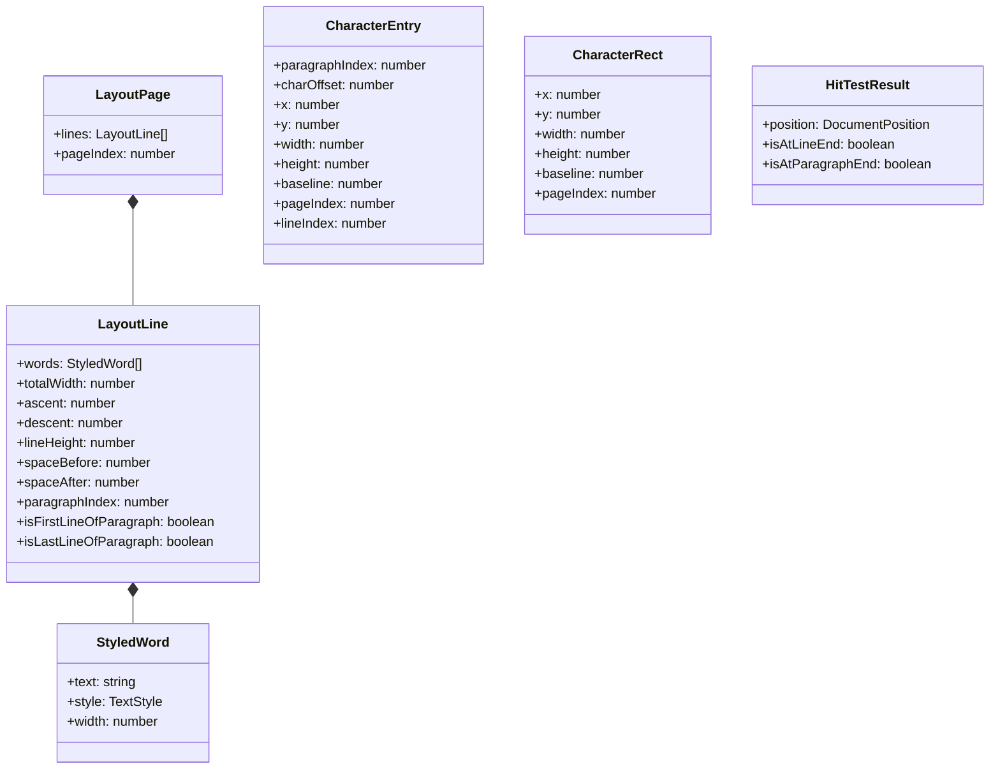
```mermaid
classDiagram
    class StyledWord {
        +text: string
        +style: TextStyle
        +width: number
    }

    class LayoutLine {
        +words: StyledWord[]
        +totalWidth: number
        +ascent: number
        +descent: number
        +lineHeight: number
        +spaceBefore: number
        +spaceAfter: number
        +paragraphIndex: number
        +isFirstLineOfParagraph: boolean
        +isLastLineOfParagraph: boolean
    }

    class LayoutPage {
        +lines: LayoutLine[]
        +pageIndex: number
    }

    class CharacterEntry {
        +paragraphIndex: number
        +charOffset: number
        +x: number
        +y: number
        +width: number
        +height: number
        +baseline: number
        +pageIndex: number
        +lineIndex: number
    }

    class CharacterRect {
        +x: number
        +y: number
        +width: number
        +height: number
        +baseline: number
        +pageIndex: number
    }

    class HitTestResult {
        +position: DocumentPosition
        +isAtLineEnd: boolean
        +isAtParagraphEnd: boolean
    }

    LayoutPage *-- LayoutLine
    LayoutLine *-- StyledWord
```

> [!NOTE]
> `LayoutLine` gained three new properties in Phase 2: `paragraphIndex`, `isFirstLineOfParagraph`, and `isLastLineOfParagraph`. These enable the `LayoutIndex` to map lines back to their source paragraphs for cursor navigation and hit-testing.

### 5.2 Layout Index

The [LayoutIndex](file:///home/madhusha-laksitha/Desktop/freewriter/packages/core/src/layout/layout-index.ts) implements the **Facade pattern** — it provides a simple API over complex character-level position data. It enables bidirectional coordinate mapping:

```
(x, y) canvas click  →  (paragraphIndex, charOffset)   [hit testing]
(paragraphIndex, charOffset)  →  (x, y, width, height) [caret placement]
```

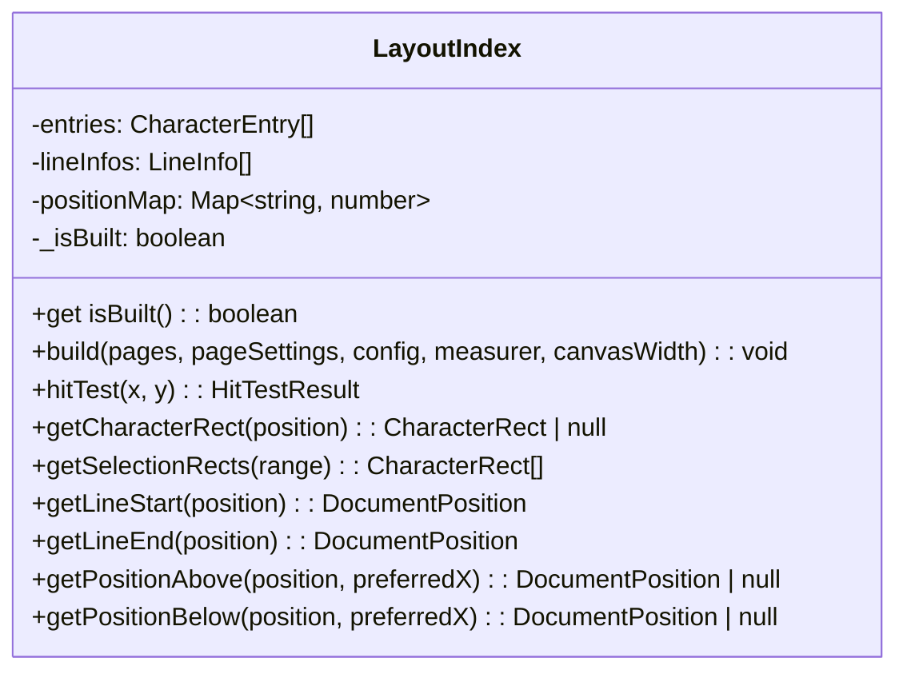
```mermaid
classDiagram
    class LayoutIndex {
        -entries: CharacterEntry[]
        -lineInfos: LineInfo[]
        -positionMap: Map~string, number~
        -_isBuilt: boolean
        +get isBuilt(): boolean
        +build(pages, pageSettings, config, measurer, canvasWidth): void
        +hitTest(x, y): HitTestResult
        +getCharacterRect(position): CharacterRect | null
        +getSelectionRects(range): CharacterRect[]
        +getLineStart(position): DocumentPosition
        +getLineEnd(position): DocumentPosition
        +getPositionAbove(position, preferredX): DocumentPosition | null
        +getPositionBelow(position, preferredX): DocumentPosition | null
    }
```

**Implementation strategy**:
- `build()` walks every line and word from the rendered `LayoutPage[]`, measures individual characters, and produces a flat array of `CharacterEntry` objects.
- A `positionMap` (`Map<"paraIndex:charOffset", entryArrayIndex>`) enables O(1) document-position → pixel-rect lookups.
- `hitTest()` finds the closest line by Y coordinate, then the closest character within that line by X coordinate, using the midpoint of each character to decide left/right placement.
- `getSelectionRects()` walks each line and clips to the selection boundaries, producing one `CharacterRect` per line in the selection.
- `getPositionAbove()`/`getPositionBelow()` enable vertical cursor navigation by finding the character on the adjacent line closest to the `preferredX` coordinate.

---

## 6. Canvas Renderer

The renderer ([canvas-renderer.ts](file:///home/madhusha-laksitha/Desktop/freewriter/packages/core/src/renderer/canvas-renderer.ts)) orchestrates a **layout → paginate → draw** pipeline. Phase 2 added layout result caching and overlay drawing methods.

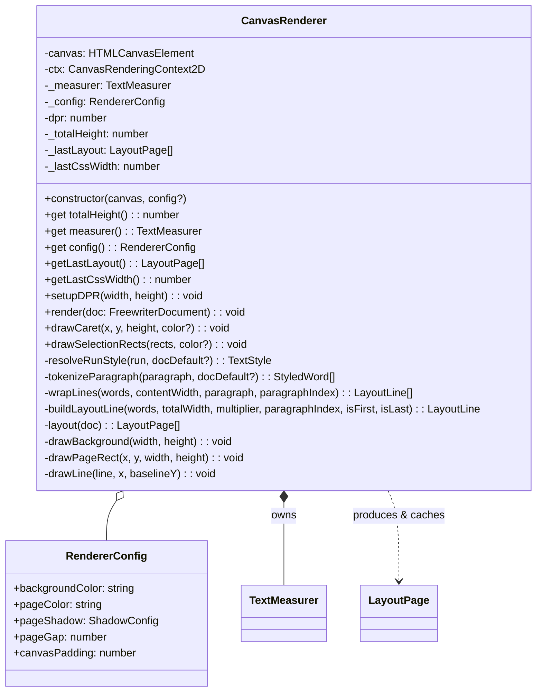
```mermaid
classDiagram
    class CanvasRenderer {
        -canvas: HTMLCanvasElement
        -ctx: CanvasRenderingContext2D
        -_measurer: TextMeasurer
        -_config: RendererConfig
        -dpr: number
        -_totalHeight: number
        -_lastLayout: LayoutPage[]
        -_lastCssWidth: number
        +constructor(canvas, config?)
        +get totalHeight(): number
        +get measurer(): TextMeasurer
        +get config(): RendererConfig
        +getLastLayout(): LayoutPage[]
        +getLastCssWidth(): number
        +setupDPR(width, height): void
        +render(doc: FreewriterDocument): void
        +drawCaret(x, y, height, color?): void
        +drawSelectionRects(rects, color?): void
        -resolveRunStyle(run, docDefault?): TextStyle
        -tokenizeParagraph(paragraph, docDefault?): StyledWord[]
        -wrapLines(words, contentWidth, paragraph, paragraphIndex): LayoutLine[]
        -buildLayoutLine(words, totalWidth, multiplier, paragraphIndex, isFirst, isLast): LayoutLine
        -layout(doc): LayoutPage[]
        -drawBackground(width, height): void
        -drawPageRect(x, y, width, height): void
        -drawLine(line, x, baselineY): void
    }

    class RendererConfig {
        +backgroundColor: string
        +pageColor: string
        +pageShadow: ShadowConfig
        +pageGap: number
        +canvasPadding: number
    }

    CanvasRenderer o-- RendererConfig
    CanvasRenderer *-- TextMeasurer : owns
    CanvasRenderer ..> LayoutPage : produces & caches
```

**Phase 2 changes to CanvasRenderer**:
- Layout types (`StyledWord`, `LayoutLine`, `LayoutPage`) are now **imported from** `layout/layout-types.ts` instead of being defined inline.
- `_lastLayout` stores the most recent `LayoutPage[]` so the `LayoutIndex` can access it via `getLastLayout()`.
- `_lastCssWidth` stores the CSS width used during the last render for `LayoutIndex` coordinate calculations.
- `measurer` and `config` are now exposed as public getters (needed by `LayoutIndex.build()`).
- `drawCaret()` and `drawSelectionRects()` are public methods for overlay drawing.
- `wrapLines()` and `buildLayoutLine()` now accept and propagate `paragraphIndex` to `LayoutLine`.
- Empty paragraphs now produce a single empty `LayoutLine` (needed for cursor placement in empty paragraphs).

### Caret Renderer

The [CaretRenderer](file:///home/madhusha-laksitha/Desktop/freewriter/packages/core/src/renderer/caret-renderer.ts) draws a blinking cursor on the canvas using `requestAnimationFrame`.

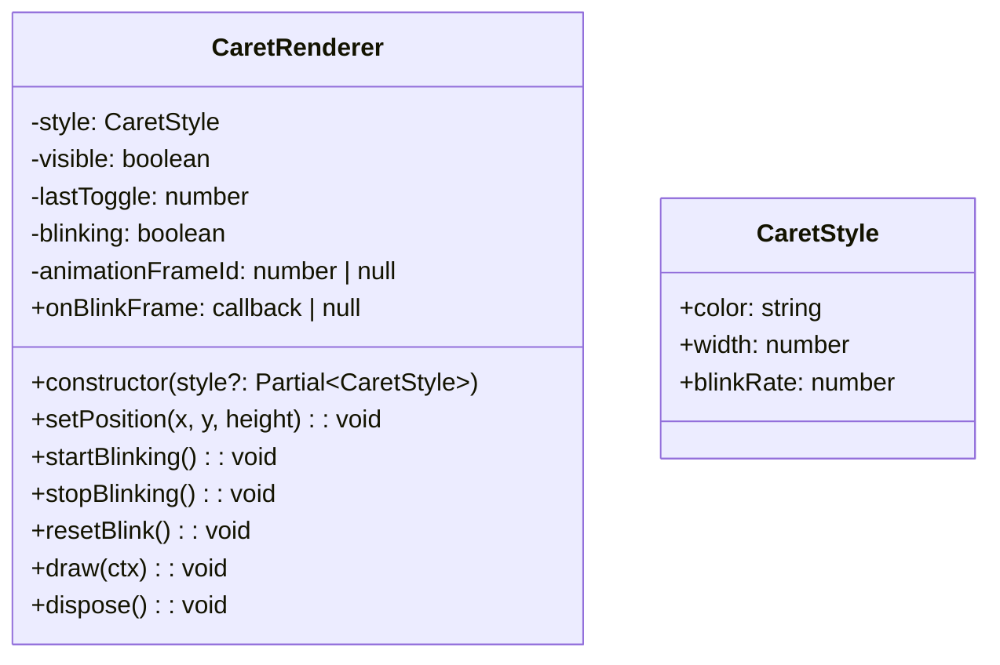
```mermaid
classDiagram
    class CaretRenderer {
        -style: CaretStyle
        -visible: boolean
        -lastToggle: number
        -blinking: boolean
        -animationFrameId: number | null
        +onBlinkFrame: callback | null
        +constructor(style?: Partial~CaretStyle~)
        +setPosition(x, y, height): void
        +startBlinking(): void
        +stopBlinking(): void
        +resetBlink(): void
        +draw(ctx): void
        +dispose(): void
    }

    class CaretStyle {
        +color: string
        +width: number
        +blinkRate: number
    }
```

**Key behaviors**:
- Default blink rate: 530ms (matches typical OS cursors).
- `resetBlink()` makes the caret solid for one full cycle (called on every user input).
- `onBlinkFrame` callback triggers a re-draw on each blink toggle.
- `startBlinking()`/`stopBlinking()` are called on focus/blur.

### Selection Renderer

The [SelectionRenderer](file:///home/madhusha-laksitha/Desktop/freewriter/packages/core/src/renderer/selection-renderer.ts) draws semi-transparent highlight rectangles over selected text.

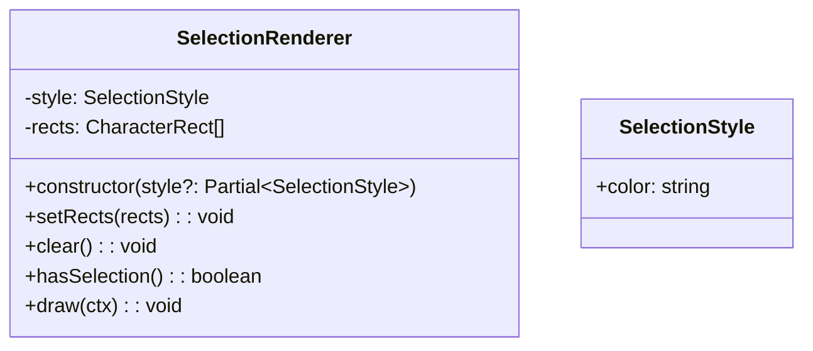
```mermaid
classDiagram
    class SelectionRenderer {
        -style: SelectionStyle
        -rects: CharacterRect[]
        +constructor(style?: Partial~SelectionStyle~)
        +setRects(rects): void
        +clear(): void
        +hasSelection(): boolean
        +draw(ctx): void
    }

    class SelectionStyle {
        +color: string
    }
```

- Default color: `rgba(66, 133, 244, 0.3)` — Google Docs blue.
- Rects are computed by `LayoutIndex.getSelectionRects()` and passed in via `setRects()`.

---

## 7. Input Handling (Phase 2)

The input module captures user interactions and translates them into `EditorState` mutations.

### 7.1 Keyboard Shortcuts

[keyboard-shortcuts.ts](file:///home/madhusha-laksitha/Desktop/freewriter/packages/core/src/input/keyboard-shortcuts.ts) implements the **Strategy pattern** — keyboard actions are data-driven bindings that can be swapped or extended without modifying existing code.

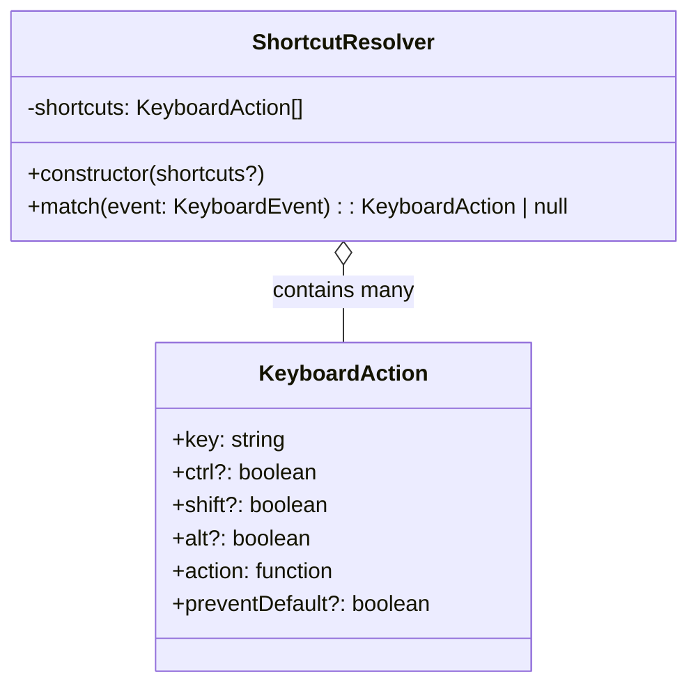
```mermaid
classDiagram
    class KeyboardAction {
        +key: string
        +ctrl?: boolean
        +shift?: boolean
        +alt?: boolean
        +action: function
        +preventDefault?: boolean
    }

    class ShortcutResolver {
        -shortcuts: KeyboardAction[]
        +constructor(shortcuts?)
        +match(event: KeyboardEvent): KeyboardAction | null
    }

    ShortcutResolver o-- KeyboardAction : contains many
```

**Default shortcuts** (`DEFAULT_SHORTCUTS`):

| Shortcut | Action |
|----------|--------|
| `Arrow keys` | Cursor movement (left, right, up, down) |
| `Shift+Arrow keys` | Extend selection |
| `Home` / `End` | Move to line start / line end |
| `Shift+Home` / `Shift+End` | Extend selection to line start / end |
| `Backspace` | Delete backward |
| `Delete` | Delete forward |
| `Enter` | Insert paragraph break |
| `Ctrl+A` | Select all |

### 7.2 Input Handler

The [InputHandler](file:///home/madhusha-laksitha/Desktop/freewriter/packages/core/src/input/input-handler.ts) implements the **hidden textarea trick** — an invisible `<textarea>` positioned over the canvas captures native keyboard events, basic IME composition, and clipboard operations.

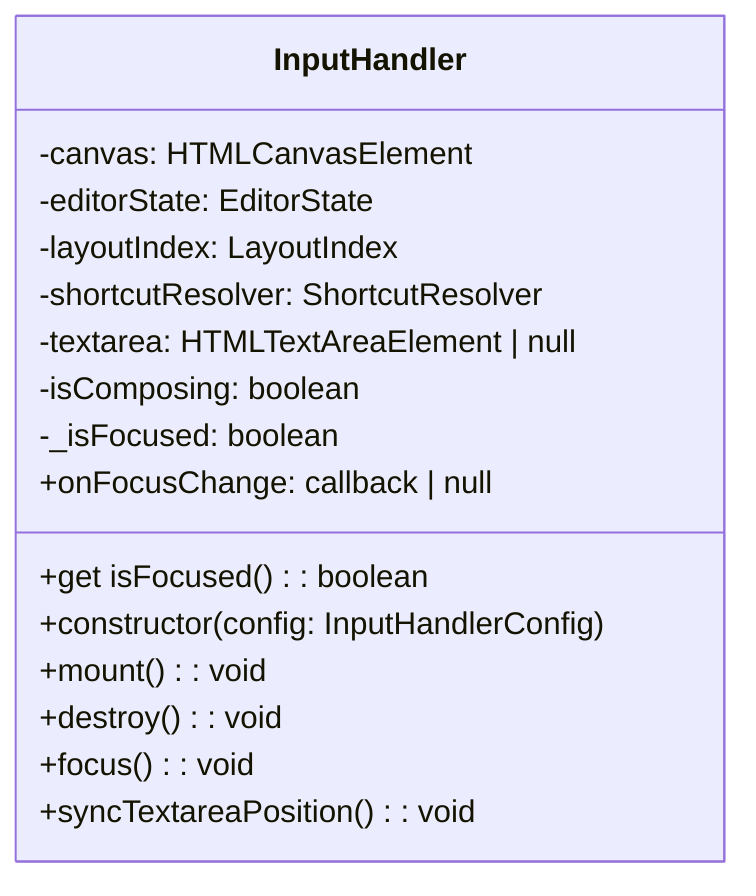
```mermaid
classDiagram
    class InputHandler {
        -canvas: HTMLCanvasElement
        -editorState: EditorState
        -layoutIndex: LayoutIndex
        -shortcutResolver: ShortcutResolver
        -textarea: HTMLTextAreaElement | null
        -isComposing: boolean
        -_isFocused: boolean
        +onFocusChange: callback | null
        +get isFocused(): boolean
        +constructor(config: InputHandlerConfig)
        +mount(): void
        +destroy(): void
        +focus(): void
        +syncTextareaPosition(): void
    }
```

**The hidden textarea**:
- Is invisible: `opacity: 0`, `1×1px`, `z-index: -1`, `pointer-events: none`.
- Is repositioned to follow the caret on every cursor change (for IME popup placement).
- Uses `fontSize: 16px` to prevent iOS auto-zoom on focus.
- Handles `input`, `keydown`, `compositionstart`, `compositionend`, `copy`, `paste`, `cut`, `focus`, `blur` events.

**Clipboard handling** (Phase 2): plain text only. Multi-line paste splits on `\n` and inserts paragraph breaks.

### 7.3 Mouse Handler

The [MouseHandler](file:///home/madhusha-laksitha/Desktop/freewriter/packages/core/src/input/mouse-handler.ts) handles canvas mouse events for caret placement and text selection.

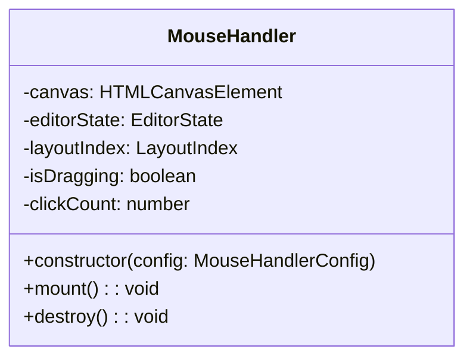
```mermaid
classDiagram
    class MouseHandler {
        -canvas: HTMLCanvasElement
        -editorState: EditorState
        -layoutIndex: LayoutIndex
        -isDragging: boolean
        -clickCount: number
        +constructor(config: MouseHandlerConfig)
        +mount(): void
        +destroy(): void
    }
```

**Click behaviors**:

| Action | Behavior |
|--------|----------|
| Single click | Position caret at clicked location |
| Shift+click | Extend selection from current cursor to click position |
| Click and drag | Select text from mousedown to current mouse position |
| Double-click | Select the word under the cursor |
| Triple-click | Select the entire paragraph |

Multi-click detection uses a 400ms timeout and 5px distance threshold.

---

## 8. Editor Orchestrator (Phase 2)

The [Editor](file:///home/madhusha-laksitha/Desktop/freewriter/packages/core/src/editor/editor.ts) class implements the **Facade pattern** — it wires together all subsystems into a single, easy-to-use API. This is the primary public API for consumers.

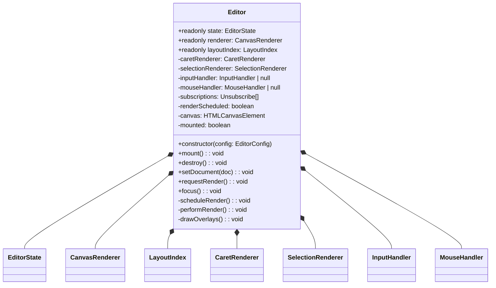
```mermaid
classDiagram
    class Editor {
        +readonly state: EditorState
        +readonly renderer: CanvasRenderer
        +readonly layoutIndex: LayoutIndex
        -caretRenderer: CaretRenderer
        -selectionRenderer: SelectionRenderer
        -inputHandler: InputHandler | null
        -mouseHandler: MouseHandler | null
        -subscriptions: Unsubscribe[]
        -renderScheduled: boolean
        -canvas: HTMLCanvasElement
        -mounted: boolean
        +constructor(config: EditorConfig)
        +mount(): void
        +destroy(): void
        +setDocument(doc): void
        +requestRender(): void
        +focus(): void
        -scheduleRender(): void
        -performRender(): void
        -drawOverlays(): void
    }

    Editor *-- EditorState
    Editor *-- CanvasRenderer
    Editor *-- LayoutIndex
    Editor *-- CaretRenderer
    Editor *-- SelectionRenderer
    Editor *-- InputHandler
    Editor *-- MouseHandler
```

### Render Pipeline — Full Data Flow

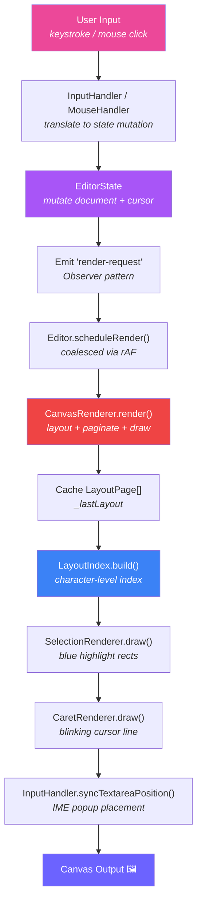
```mermaid
flowchart TB
    INPUT["User Input<br/><i>keystroke / mouse click</i>"] --> HANDLER["InputHandler / MouseHandler<br/><i>translate to state mutation</i>"]
    HANDLER --> STATE["EditorState<br/><i>mutate document + cursor</i>"]
    STATE --> EMIT["Emit 'render-request'<br/><i>Observer pattern</i>"]
    EMIT --> SCHEDULE["Editor.scheduleRender()<br/><i>coalesced via rAF</i>"]
    SCHEDULE --> RENDER["CanvasRenderer.render()<br/><i>layout + paginate + draw</i>"]
    RENDER --> LAYOUT_CACHE["Cache LayoutPage[]<br/><i>_lastLayout</i>"]
    LAYOUT_CACHE --> INDEX["LayoutIndex.build()<br/><i>character-level index</i>"]
    INDEX --> SEL_DRAW["SelectionRenderer.draw()<br/><i>blue highlight rects</i>"]
    SEL_DRAW --> CARET_DRAW["CaretRenderer.draw()<br/><i>blinking cursor line</i>"]
    CARET_DRAW --> SYNC["InputHandler.syncTextareaPosition()<br/><i>IME popup placement</i>"]
    SYNC --> CANVAS["Canvas Output 🖼️"]

    style INPUT fill:#ec4899,color:#fff
    style STATE fill:#a855f7,color:#fff
    style RENDER fill:#ef4444,color:#fff
    style INDEX fill:#3b82f6,color:#fff
    style CANVAS fill:#6c63ff,color:#fff
```

**Key orchestration details**:
- `scheduleRender()` coalesces multiple state changes within the same frame into a single render via `requestAnimationFrame`.
- `performRender()` executes the full pipeline: render → index → overlays → sync.
- `drawOverlays()` is also called independently by the caret blink animation (which needs to re-render the document since canvas is immediate-mode).
- On `mount()`, the Editor subscribes to `EditorState` events and sets up the caret blink animation.
- On `destroy()`, all subscriptions, event listeners, and animation frames are cleaned up.

---

## 9. DPR (Device Pixel Ratio) Scaling

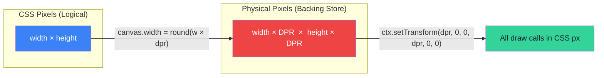
```mermaid
flowchart LR
    subgraph "CSS Pixels (Logical)"
        CSS["width × height"]
    end

    subgraph "Physical Pixels (Backing Store)"
        PHYS["width × DPR  ×  height × DPR"]
    end

    CSS -->|"canvas.width = round(w × dpr)"| PHYS
    PHYS -->|"ctx.setTransform(dpr, 0, 0, dpr, 0, 0)"| DRAW["All draw calls in CSS px"]

    style CSS fill:#3b82f6,color:#fff
    style PHYS fill:#ef4444,color:#fff
    style DRAW fill:#34d399,color:#1a1a2e
```

The canvas element's CSS size stays unchanged, but the internal resolution is multiplied by `window.devicePixelRatio`. A scale transform maps all drawing coordinates back to CSS pixel space, producing crisp text on Retina/HiDPI displays.

---

## 10. Public API Surface

Everything exported from [index.ts](file:///home/madhusha-laksitha/Desktop/freewriter/packages/core/src/index.ts):

### Type Exports

| Export | From | Description |
|--------|------|-------------|
| `TextStyle` | model | Full styling for a text run |
| `FontWeight` | model | `"normal"` \| `"bold"` |
| `FontStyle` | model | `"normal"` \| `"italic"` |
| `TextDecoration` | model | `"none"` \| `"underline"` \| `"line-through"` |
| `TextRun` | model | Atomic unit of styled text |
| `Paragraph` | model | Array of runs with paragraph formatting |
| `ParagraphAlignment` | model | `"left"` \| `"center"` \| `"right"` \| `"justify"` |
| `PageSettings` | model | Page dimensions and margins |
| `FreewriterDocument` | model | Top-level document |
| `TextMeasurement` | measurement | Result of measuring text |
| `RendererConfig` | renderer | Renderer appearance configuration |
| `CaretStyle` | renderer | Caret appearance configuration |
| `SelectionStyle` | renderer | Selection highlight configuration |
| `StyledWord` | layout | A word token with resolved style and measured width |
| `LayoutLine` | layout | A line of styled words with metrics |
| `LayoutPage` | layout | A page of layout lines |
| `CharacterRect` | layout | Pixel rectangle for a character position |
| `CharacterEntry` | layout | Full character-level index entry |
| `HitTestResult` | layout | Result of an (x, y) → document position hit test |
| `DocumentPosition` | state | Paragraph index + character offset |
| `SelectionRange` | state | Anchor + focus document positions |
| `MutationResult` | state | New document + new cursor position |
| `EditorStateSnapshot` | state | Full snapshot of editor state |
| `EditorStateEvents` | state | Event map for EditorState |
| `EventMap` | state | Generic event map constraint |
| `EventHandler` | state | Handler function type |
| `Unsubscribe` | state | Unsubscribe function type |
| `InputHandlerConfig` | input | Configuration for InputHandler |
| `MouseHandlerConfig` | input | Configuration for MouseHandler |
| `KeyboardAction` | input | Keyboard shortcut binding |
| `EditorConfig` | editor | Configuration for the Editor facade |

### Value Exports

| Export | From | Description |
|--------|------|-------------|
| `DEFAULT_TEXT_STYLE` | model | Fallback text style constant |
| `DEFAULT_PARAGRAPH_PROPS` | model | Fallback paragraph properties |
| `DEFAULT_PAGE_SETTINGS` | model | US Letter page defaults |
| `TextMeasurer` | measurement | Measurement class |
| `buildFontString` | measurement | CSS font shorthand builder |
| `resolveStyle` | measurement | Partial → full `TextStyle` resolver |
| `CanvasRenderer` | renderer | Main rendering engine class |
| `CaretRenderer` | renderer | Blinking cursor renderer |
| `SelectionRenderer` | renderer | Selection highlight renderer |
| `LayoutIndex` | layout | Bidirectional coordinate mapping |
| `EditorState` | state | Central state container |
| `EventEmitter` | state | Typed event emitter |
| `InputHandler` | input | Hidden textarea input manager |
| `MouseHandler` | input | Canvas mouse event handler |
| `ShortcutResolver` | input | Keyboard shortcut matcher |
| `DEFAULT_SHORTCUTS` | input | Default keyboard shortcut bindings |
| `Editor` | editor | **Primary API** — Facade wiring everything together |

---

## 11. File Tree

```
packages/core/
├── ARCHITECTURE.md                 # This file
├── package.json                    # @freewriter/core — v0.0.1, zero deps
├── tsconfig.json                   # Extends ../../tsconfig.base.json
├── src/
│   ├── index.ts                    # Barrel re-exports from all modules
│   ├── model/
│   │   ├── index.ts                # Re-exports from document.ts
│   │   └── document.ts             # FreewriterDocument, Paragraph, TextRun, TextStyle,
│   │                               # PageSettings, and all default constants
│   ├── measurement/
│   │   ├── index.ts                # Re-exports from text-measurer.ts
│   │   └── text-measurer.ts        # TextMeasurer class, buildFontString(), resolveStyle()
│   ├── layout/                     # [NEW — Phase 2]
│   │   ├── index.ts                # Re-exports from layout-types.ts and layout-index.ts
│   │   ├── layout-types.ts         # StyledWord, LayoutLine, LayoutPage, CharacterEntry,
│   │   │                           # CharacterRect, HitTestResult (extracted from renderer)
│   │   └── layout-index.ts         # LayoutIndex class — coordinate ↔ position mapping
│   ├── state/                      # [NEW — Phase 2]
│   │   ├── index.ts                # Re-exports from all state module files
│   │   ├── event-emitter.ts        # EventEmitter class (Observer pattern)
│   │   ├── document-mutator.ts     # Pure mutation functions (insertTextAt, deleteCharBackward, etc.)
│   │   └── editor-state.ts         # EditorState class (Mediator pattern)
│   ├── input/                      # [NEW — Phase 2]
│   │   ├── index.ts                # Re-exports from all input module files
│   │   ├── keyboard-shortcuts.ts   # ShortcutResolver class, DEFAULT_SHORTCUTS (Strategy pattern)
│   │   ├── input-handler.ts        # InputHandler class (hidden textarea trick)
│   │   └── mouse-handler.ts        # MouseHandler class (click, drag, double/triple-click)
│   ├── renderer/
│   │   ├── index.ts                # Re-exports from all renderer files
│   │   ├── canvas-renderer.ts      # CanvasRenderer class — layout engine + draw calls
│   │   ├── caret-renderer.ts       # [NEW — Phase 2] CaretRenderer class (blinking cursor)
│   │   └── selection-renderer.ts   # [NEW — Phase 2] SelectionRenderer class (blue highlights)
│   └── editor/                     # [NEW — Phase 2]
│       ├── index.ts                # Re-exports from editor.ts
│       └── editor.ts               # Editor class (Facade pattern — orchestrates everything)
└── dist/                           # Compiled output (tsc)
```

---

## 12. Integration: How Core Is Consumed

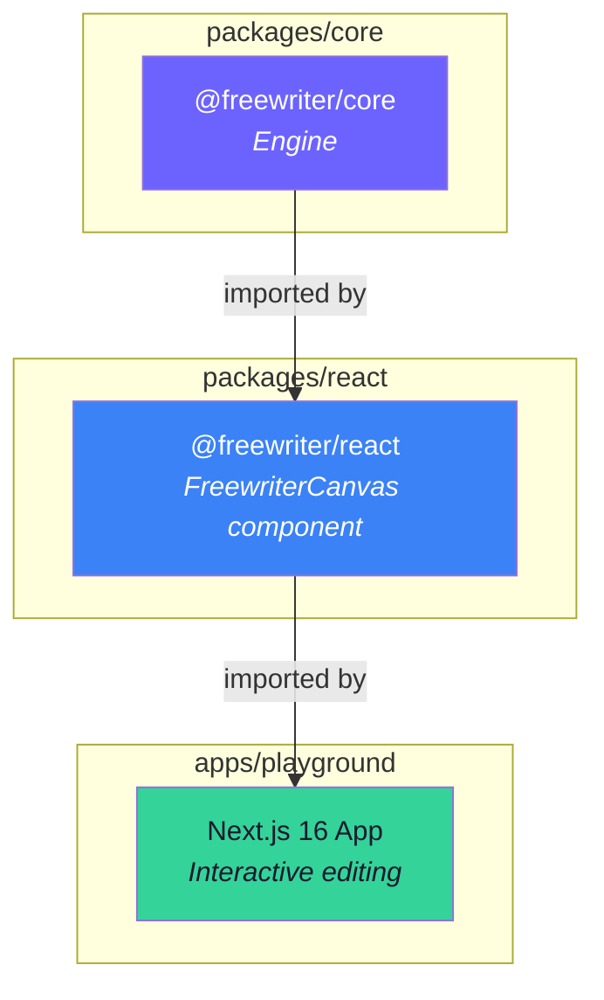
```mermaid
graph TB
    subgraph "packages/core"
        CORE["@freewriter/core<br/><i>Engine</i>"]
    end

    subgraph "packages/react"
        REACT["@freewriter/react<br/><i>FreewriterCanvas component</i>"]
    end

    subgraph "apps/playground"
        PLAY["Next.js 16 App<br/><i>Interactive editing</i>"]
    end

    CORE -->|"imported by"| REACT
    REACT -->|"imported by"| PLAY

    style CORE fill:#6c63ff,color:#fff
    style REACT fill:#3b82f6,color:#fff
    style PLAY fill:#34d399,color:#1a1a2e
```

- **`@freewriter/react`** imports the `Editor` class (Phase 2) to create a `<FreewriterCanvas />` React component that manages the editor lifecycle (mount/destroy), resize observation, DPR change detection, and exposes `onCursorChange` / `onDocumentChange` callbacks for status bar integration.
- **`apps/playground`** imports the React wrapper and renders an interactive sample document. The status bar displays paragraph count, cursor position (paragraph + character offset), and DPR.

---

## 13. Design Patterns

| Pattern | Where | Why |
|---------|-------|-----|
| **Observer** | `EventEmitter`, `EditorState` | Decouples state changes from rendering; React wrapper subscribes to state changes without the core knowing about React |
| **Strategy** | `ShortcutResolver`, `DEFAULT_SHORTCUTS` | Extensible shortcut system; future phases can add formatting shortcuts (Ctrl+B, Ctrl+I) without modifying existing code |
| **Facade** | `Editor` class, `LayoutIndex` | Simplifies the complex internal wiring for consumers; a single `new Editor()` call sets up the entire system |
| **Mediator** | `EditorState` | Mediates between input handlers, document model, and renderer — none of them know about each other directly |
| **Single Responsibility** | `DocumentMutator`, `CaretRenderer`, `SelectionRenderer` | Each class/module does exactly one thing; mutation logic is isolated from state management, caret drawing from selection drawing |
| **Immutable Data** | `document-mutator.ts` functions | Pure functions return new document objects; enables future undo/redo (Phase 4) and React reconciliation |

---

## 14. Design Principles & Constraints

| Principle | Detail |
|-----------|--------|
| **Zero runtime deps** | `package.json` has only `devDependencies` (TypeScript). The engine is fully self-contained. |
| **Strict TypeScript** | `noUnusedLocals`, `noUncheckedIndexedAccess`, full strict mode via `tsconfig.base.json`. |
| **Immutable mutations** | All document mutations produce new objects. The original document is never modified. |
| **CRDT-compatible model** | `TextRun[]` array structure designed for future Yjs/Automerge integration. |
| **WASM-migration ready** | Pure TS engine with no DOM dependencies in model/measurement/state layers. |
| **Canvas-only rendering** | All text drawn via `ctx.fillText()`. No DOM text nodes, no `contenteditable`. |
| **Framework-agnostic core** | All interaction logic lives in `@freewriter/core`. React is a thin lifecycle bridge. |

---

## 15. Current Limitations (Phase 2)

- **Greedy word-wrap only** — Knuth-Plass line breaking planned for Phase 3
- **No rich text clipboard** — Copy/paste is plain text only; rich text (with styles) planned for a later phase
- **No full IME composition rendering** — Basic IME works via hidden textarea; polished composition preview (underlined text on canvas) planned for a later phase
- **No undo/redo** — Command pattern planned for Phase 4
- **No collaboration** — CRDT integration planned for Phase 5
- **No export** — PDF/HTML export planned for Phase 5
- **Left-alignment only** — `alignment` property exists in the model but center/right/justify are not yet implemented in the renderer
- **No text decoration rendering** — `textDecoration` is modeled but underline/strikethrough are not drawn
- **No Piece Table** — Document uses a simple linear array of runs; Piece Table planned for a later phase
