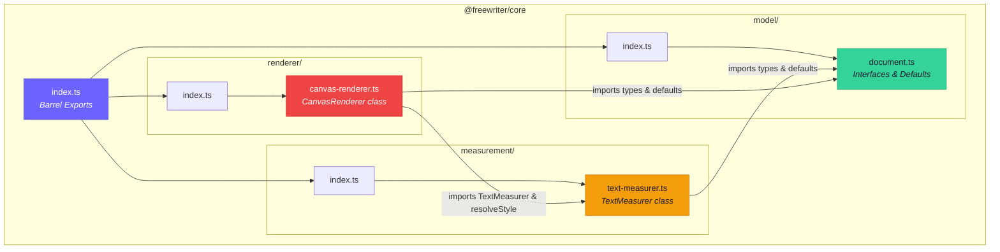
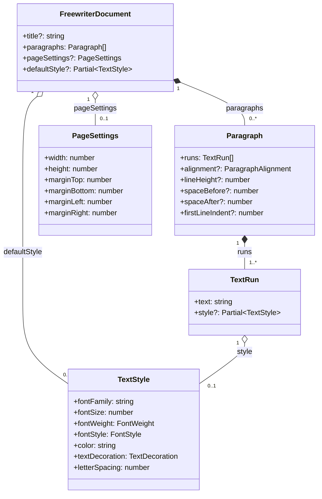
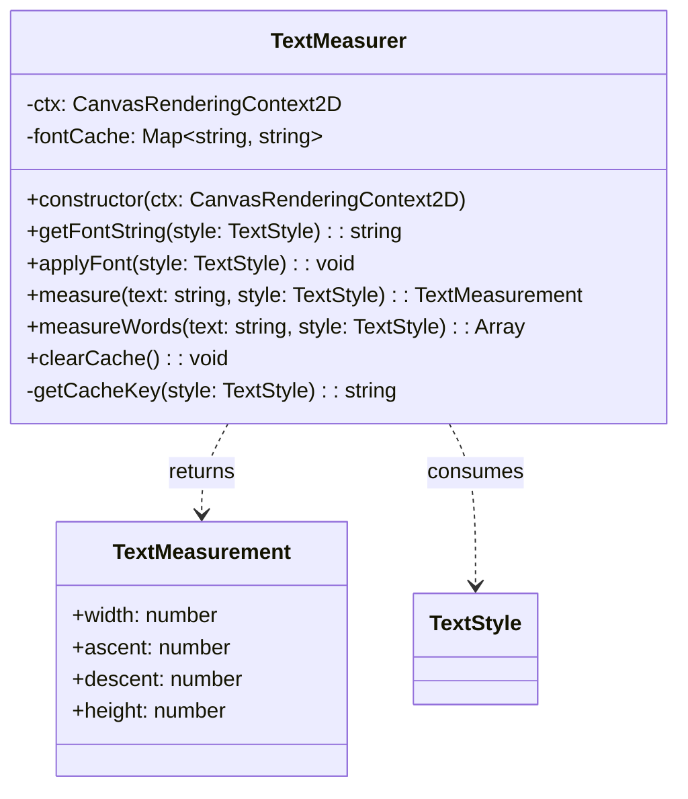
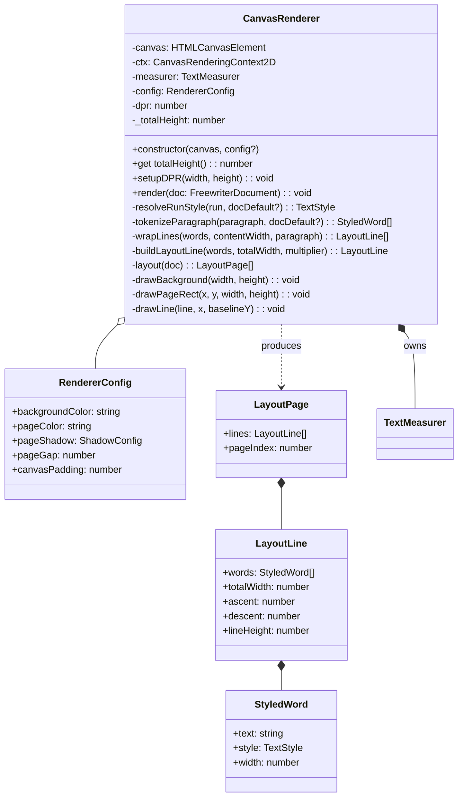
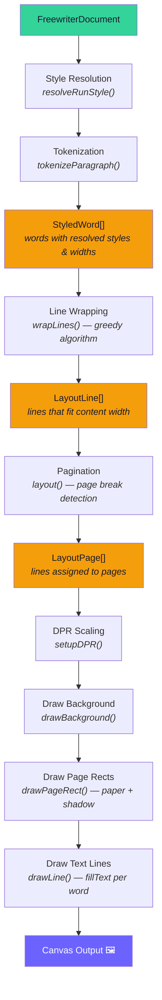
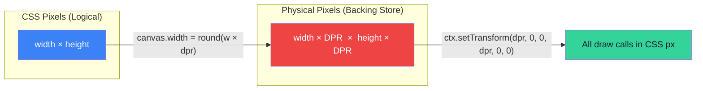
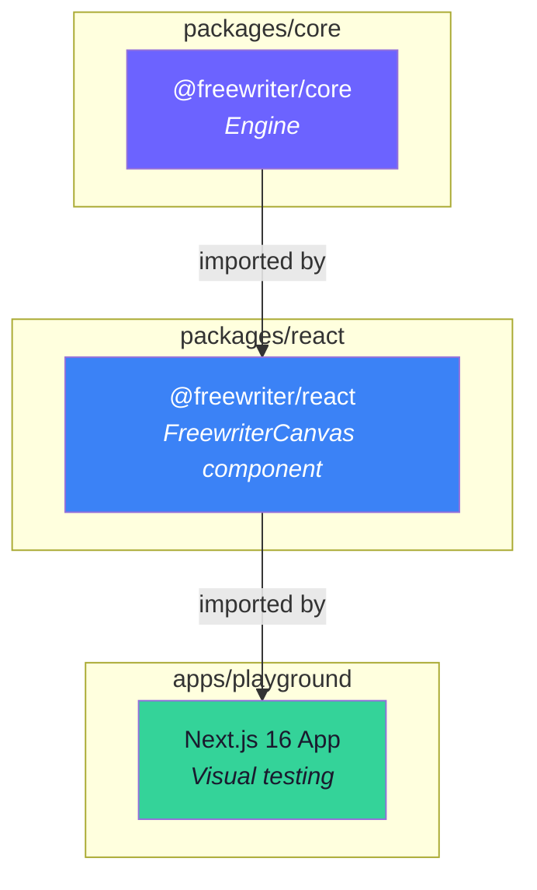

# @freewriter/core — Architecture

> Pure TypeScript canvas-based word processor engine — zero runtime dependencies.
> **Status:** Phase 1 (Foundation) — static rendering, data model, DPR scaling.

---

## 1. High-Level Module Overview

The core package is split into three modules with a strict dependency hierarchy: the **model** defines data, the **measurement** reads the model to compute metrics, and the **renderer** orchestrates both to draw onto a canvas.



### Dependency Direction

```
model/  ← (no deps, pure data)
  ↑
measurement/  ← depends on model
  ↑
renderer/  ← depends on model + measurement
```

> [!IMPORTANT]
> The dependency flow is strictly **unidirectional**. `model/` has zero imports from other modules, making it the foundation layer. This design enables future migration of the layout engine to Rust/WASM without touching the data layer.

---

## 2. Document Data Model

The model layer ([document.ts](file:///home/madhusha-laksitha/Desktop/freewriter/packages/core/src/model/document.ts)) defines a hierarchical document tree with four levels:



### Type Aliases

| Type | Values | Used By |
|------|--------|---------|
| `FontWeight` | `"normal"` \| `"bold"` | `TextStyle.fontWeight` |
| `FontStyle` | `"normal"` \| `"italic"` | `TextStyle.fontStyle` |
| `TextDecoration` | `"none"` \| `"underline"` \| `"line-through"` | `TextStyle.textDecoration` |
| `ParagraphAlignment` | `"left"` \| `"center"` \| `"right"` \| `"justify"` | `Paragraph.alignment` |

### Default Constants

| Constant | Key Defaults |
|----------|-------------|
| `DEFAULT_TEXT_STYLE` | Inter, 12pt, normal weight, `#1a1a2e` color |
| `DEFAULT_PARAGRAPH_PROPS` | left-aligned, 1.5× line height, 8pt space after |
| `DEFAULT_PAGE_SETTINGS` | US Letter (612×792 pt), 1-inch (72pt) margins |

---

## 3. Measurement Engine

The measurement layer ([text-measurer.ts](file:///home/madhusha-laksitha/Desktop/freewriter/packages/core/src/measurement/text-measurer.ts)) wraps the Canvas 2D `measureText()` API with caching and style resolution.



### Standalone Functions

| Function | Purpose |
|----------|---------|
| `resolveStyle(partial?)` | Merges a `Partial<TextStyle>` over `DEFAULT_TEXT_STYLE` |
| `buildFontString(style)` | Builds a CSS font shorthand — e.g. `"italic bold 16px Inter"` |

### Font Cache Strategy

The `TextMeasurer` maintains an in-memory `Map<string, string>` keyed by `fontFamily|fontSize|fontWeight|fontStyle`. This avoids rebuilding the CSS font string for repeated style combinations during layout and rendering passes.

---

## 4. Canvas Renderer

The renderer ([canvas-renderer.ts](file:///home/madhusha-laksitha/Desktop/freewriter/packages/core/src/renderer/canvas-renderer.ts)) is the largest module. It orchestrates a **layout → paginate → draw** pipeline.



### Internal Layout Types

These types are internal to the renderer (not exported) and represent the intermediate layout state:

| Type | Purpose |
|------|---------|
| `StyledWord` | A single word token with resolved `TextStyle` and measured pixel width |
| `LayoutLine` | A sequence of `StyledWord`s that fit within the content width, with computed ascent/descent/lineHeight |
| `LayoutPage` | A collection of `LayoutLine`s assigned to a single page, with a page index |

---

## 5. Render Pipeline — Data Flow

The `render()` method orchestrates a multi-phase pipeline. The document model flows through layout, pagination, and finally draw calls:



### Pipeline Phases in Detail

#### Phase A: Style Resolution
Each `TextRun.style` (partial) is merged with the document's `defaultStyle` and the global `DEFAULT_TEXT_STYLE` to produce a fully-resolved `TextStyle`.

#### Phase B: Tokenization
Paragraphs are split into word-level tokens. Each run's text is split by spaces (preserving spaces as separate tokens). Each token is measured using `TextMeasurer.measureWords()`.

#### Phase C: Line Wrapping (Greedy)
A greedy word-wrap algorithm fits `StyledWord`s into lines within the content width (`pageWidth - marginLeft - marginRight`). First-line indent is applied on the first line of each paragraph.

#### Phase D: Pagination
Lines are assigned to pages. When accumulated line heights exceed the content height (`pageHeight - marginTop - marginBottom`), a new page is started. Paragraph spacing (`spaceBefore`, `spaceAfter`) is accounted for.

#### Phase E: Drawing
1. **`setupDPR()`** — Configures the canvas backing store to `width × DPR` physical pixels, sets CSS dimensions, and applies a DPR scale transform.
2. **`drawBackground()`** — Fills the entire canvas with `backgroundColor`.
3. **`drawPageRect()`** — For each page, draws a white rectangle with a drop shadow (Google Docs-style paper).
4. **`drawLine()`** — For each line, iterates over words and calls `ctx.fillText()` with the word's style and color.

---

## 6. DPR (Device Pixel Ratio) Scaling



The canvas element's CSS size stays unchanged, but the internal resolution is multiplied by `window.devicePixelRatio`. A scale transform maps all drawing coordinates back to CSS pixel space, producing crisp text on Retina/HiDPI displays.

---

## 7. Public API Surface

Everything exported from [index.ts](file:///home/madhusha-laksitha/Desktop/freewriter/packages/core/src/index.ts):

### Type Exports

| Export | From | Description |
|--------|------|-------------|
| `TextStyle` | model | Full styling for a text run |
| `FontWeight` | model | `"normal"` \| `"bold"` |
| `FontStyle` | model | `"normal"` \| `"italic"` |
| `TextDecoration` | model | `"none"` \| `"underline"` \| `"line-through"` |
| `TextRun` | model | Atomic unit of styled text |
| `Paragraph` | model | Array of runs with paragraph formatting |
| `ParagraphAlignment` | model | `"left"` \| `"center"` \| `"right"` \| `"justify"` |
| `PageSettings` | model | Page dimensions and margins |
| `FreewriterDocument` | model | Top-level document |
| `TextMeasurement` | measurement | Result of measuring text |
| `RendererConfig` | renderer | Renderer appearance configuration |

### Value Exports

| Export | From | Description |
|--------|------|-------------|
| `DEFAULT_TEXT_STYLE` | model | Fallback text style constant |
| `DEFAULT_PARAGRAPH_PROPS` | model | Fallback paragraph properties |
| `DEFAULT_PAGE_SETTINGS` | model | US Letter page defaults |
| `TextMeasurer` | measurement | Measurement class |
| `buildFontString` | measurement | CSS font shorthand builder |
| `resolveStyle` | measurement | Partial → full `TextStyle` resolver |
| `CanvasRenderer` | renderer | Main rendering engine class |

---

## 8. File Tree

```
packages/core/
├── package.json                    # @freewriter/core — v0.0.1, zero deps
├── tsconfig.json                   # Extends ../../tsconfig.base.json
├── src/
│   ├── index.ts                    # Barrel re-exports from all modules
│   ├── model/
│   │   ├── index.ts                # Re-exports from document.ts
│   │   └── document.ts             # FreewriterDocument, Paragraph, TextRun, TextStyle,
│   │                               # PageSettings, and all default constants
│   ├── measurement/
│   │   ├── index.ts                # Re-exports from text-measurer.ts
│   │   └── text-measurer.ts        # TextMeasurer class, buildFontString(), resolveStyle()
│   └── renderer/
│       ├── index.ts                # Re-exports from canvas-renderer.ts
│       └── canvas-renderer.ts      # CanvasRenderer class — layout engine + draw calls
└── dist/                           # Compiled output (tsc)
```

---

## 9. Integration: How Core Is Consumed



- **`@freewriter/react`** imports `CanvasRenderer` and model types to create a `<FreewriterCanvas />` React component that manages the canvas lifecycle, resize observation, and DPR change detection.
- **`apps/playground`** imports the React wrapper and renders a hardcoded sample document for visual testing.

---

## 10. Design Principles & Constraints

| Principle | Detail |
|-----------|--------|
| **Zero runtime deps** | `package.json` has only `devDependencies` (TypeScript). The engine is fully self-contained. |
| **Strict TypeScript** | `noUnusedLocals`, `noUncheckedIndexedAccess`, full strict mode via `tsconfig.base.json`. |
| **Stateless rendering** | `render()` reads the document and produces canvas commands — no model mutation. |
| **CRDT-compatible model** | `TextRun[]` array structure designed for future Yjs/Automerge integration. |
| **WASM-migration ready** | Pure TS engine with no DOM dependencies in model/measurement layers. |
| **Canvas-only rendering** | All text drawn via `ctx.fillText()`. No DOM text nodes, no `contenteditable`. |

---

## 11. Current Limitations (Phase 1)

- **No user input** — No caret, selection, or keyboard handling
- **Greedy word-wrap only** — Knuth-Plass line breaking planned for Phase 3
- **No undo/redo** — Command pattern planned for Phase 4
- **No collaboration** — CRDT integration planned for Phase 5
- **No export** — PDF/HTML export planned for Phase 5
- **Left-alignment only** — `alignment` property exists in the model but center/right/justify are not yet implemented in the renderer
- **No text decoration rendering** — `textDecoration` is modeled but underline/strikethrough are not drawn
